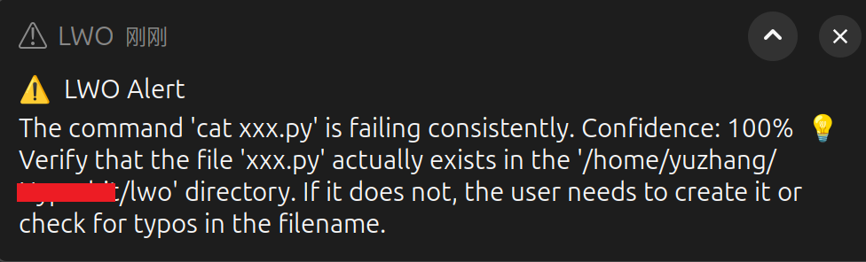

# Linux Workspace Observer (LWO)

A **headless intelligent assistant** running in the background on Linux.
It collects low‑level system signals and development toolchain states,
uses an OpenAI Agent to infer the user's **work intent**, and outputs
**structured summaries**.

## Core Features

### Data Collection

-   **Shell Hook**: Captures command content, working directory,
    execution time, and exit code\
-   **Process Monitoring**: Identifies active "heavy" processes (IDE,
    Docker, compilers) every 60 seconds\
-   **Git Context**: Automatically detects Git repositories and records
    branch intent (e.g., `fix/`, `feat/`)\
-   **File Monitoring**: Intelligently discovers project directories and
    monitors file changes (based on inotify)

### Intelligent Analysis

-   **OpenAI Agent**: Uses Gemini to analyze work status\
-   **Automatic Inference**: Identifies current state (Coding /
    Debugging / Learning / Idle)\
-   **Smart Directory Discovery**: AI automatically analyzes and
    recommends project directories to monitor

### Privacy Protection

-   **Sensitive Data Redaction**: Automatically filters passwords, API
    keys, emails, etc.\
-   **Data Retention Policy**: Raw data retained for 7 days; aggregated
    data retained for 30 days

## Installation

### 1. Clone the Project

``` bash
git clone <repository-url>
cd lwo
```

### 2. Install Dependencies

``` bash
# The project uses uv to manage dependencies
uv sync
```

### 3. Configure the Database

``` bash
# Create a PostgreSQL database
createdb lwo
```

### 4. Edit Configuration File

Copy the template and modify:

``` bash
cp config/lwo.toml.example ~/.config/lwo/lwo.toml
```

## Usage

### Start the Daemon

``` bash
source dev.sh
uv run main.py start & 

# e.g.: cat not exist file.
# cat xxx.py
# cat xxx.py
# cat xxx.py
```


### View Current Work Summary

``` bash
uv run main.py report --hours 8
```
```
📊 ACTIVITY STATISTICS
----------------------------------------------------------------------
Commands executed: 52 (26 failed)
Directories: 1
Files modified: 35
Languages: py(12), md(12), json(10), toml(1)

🌿 Git: main (other)

⚠️  Host errors: 133

----------------------------------------------------------------------
🤖 AI SUMMARY
----------------------------------------------------------------------
The developer was actively working on a project, likely involving Python, Markdown, and JSON files, ...

======================================================================
```
### Generate Daily Report

``` bash
uv run main.py daily
```

### Stop the Daemon

``` bash
uv run main.py stop
```

## License

MIT